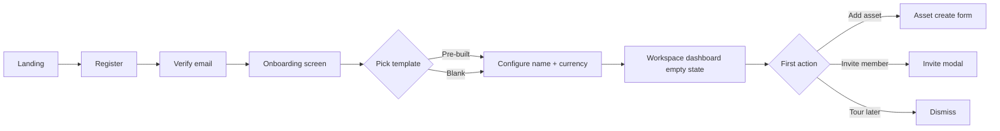
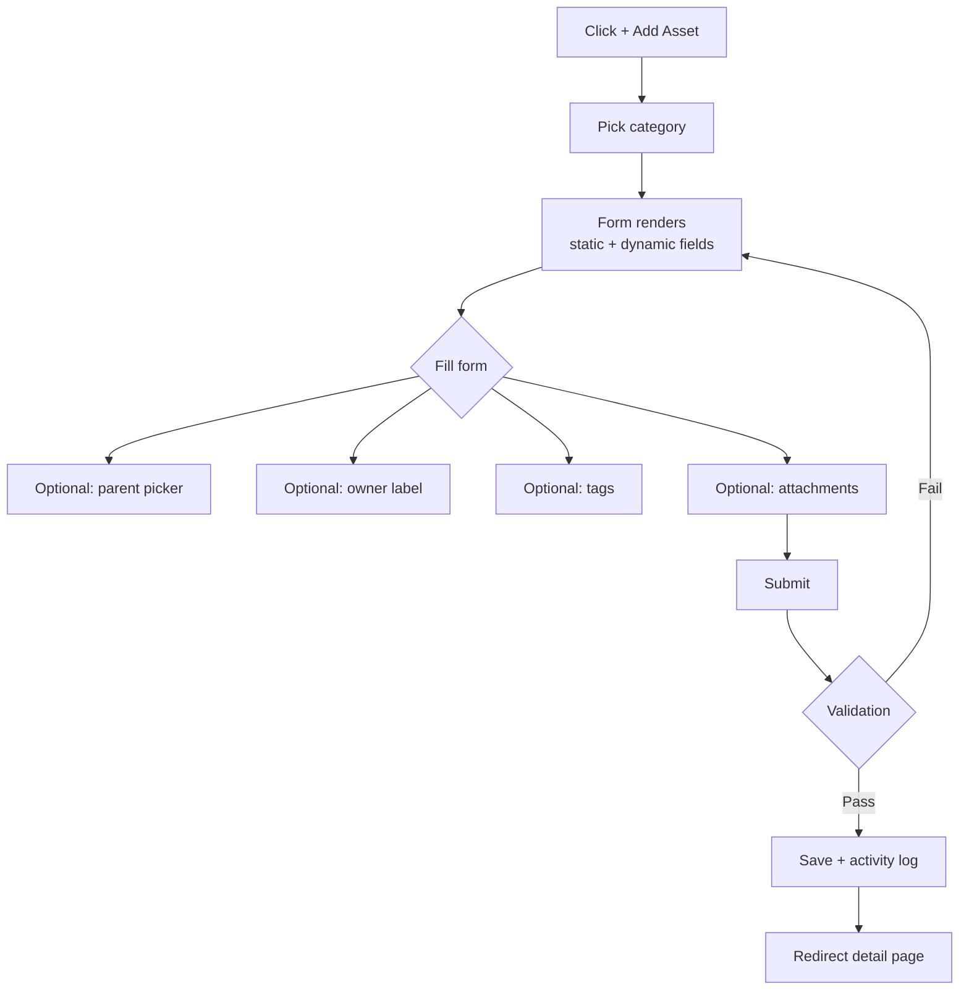
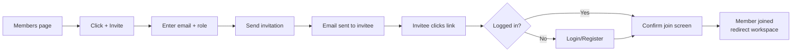
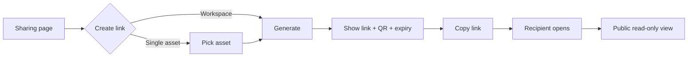
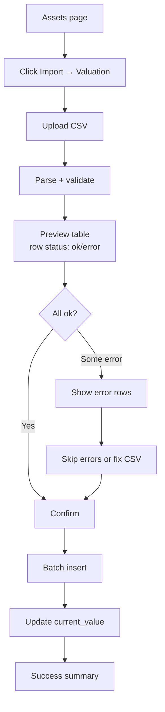

# UX Flow Design

# Collaborative Asset Workspace Platform

Version: 0.2
Source: [prd.md](../prd.md) + [mvp-stories.md](mvp-stories.md)

---

## 1. Navigation Structure

```
/                         → landing / marketing
/login                    → login
/register                 → register
/verify-email/:token      → email verification
/forgot-password          → reset request
/reset-password/:token    → reset form
/onboarding               → first workspace create

/app                      → workspace list (workspace switcher)
/app/w/:slug              → workspace dashboard
/app/w/:slug/assets       → asset list
/app/w/:slug/assets/:id   → asset detail
/app/w/:slug/assets/new   → asset create
/app/w/:slug/categories   → category settings
/app/w/:slug/owners       → owner label settings
/app/w/:slug/tags         → tag settings
/app/w/:slug/members      → member management
/app/w/:slug/sharing      → public share settings
/app/w/:slug/activity     → activity log
/app/w/:slug/settings     → workspace settings

/public/:token            → public read-only view
```

---

## 2. Global Layout

### 2.1 App Shell

```
┌─────────────────────────────────────────────────────┐
│ [LOGO]  [Workspace ▼]    [Search]   [+ New ▼] [👤] │  ← TopBar
├─────┬───────────────────────────────────────────────┤
│ 🏠  │                                               │
│ 📦  │                                               │
│ 🏷️  │              Main content                     │
│ 👥  │                                               │
│ 📊  │                                               │
│ 🔗  │                                               │
│ ⚙️  │                                               │
└─────┴───────────────────────────────────────────────┘
 sidebar
```

Sidebar items: Dashboard, Assets, Categories, Members, Activity, Sharing, Settings.

### 2.2 Workspace switcher (top bar)

```
┌────────────────────────────┐
│ 🔍 Search workspace...     │
├────────────────────────────┤
│ ★ Family Asset             │
│   Personal Wealth          │
│   Office Equipment         │
├────────────────────────────┤
│ + Create new workspace     │
│ ⚙ Manage all workspaces    │
└────────────────────────────┘
```

---

## 3. Critical User Journeys

### 3.1 First-Time User Onboarding



**Screen — Onboarding template picker**:

```
┌──────────────────────────────────────────────┐
│  Welcome! Pick a starter template            │
│                                              │
│  ┌──────┐ ┌──────┐ ┌──────┐ ┌──────┐         │
│  │Blank │ │Family│ │Office│ │Crypto│   ...   │
│  │      │ │Asset │ │Equip │ │Port. │         │
│  └──────┘ └──────┘ └──────┘ └──────┘         │
│                                              │
│  Workspace name: [___________________]       │
│  Display currency: [IDR ▼]                   │
│                                              │
│         [Skip onboarding]  [Create →]        │
└──────────────────────────────────────────────┘
```

**Empty state dashboard CTA**:

```
┌────────────────────────────────────────┐
│  📦 No assets yet                       │
│                                        │
│  Start by adding your first asset      │
│  or invite team members to collaborate │
│                                        │
│  [+ Add Asset]  [👥 Invite Member]      │
│                                        │
│  💡 Or import from CSV                  │
└────────────────────────────────────────┘
```

---

### 3.2 Add Asset (with Dynamic Fields)



**Form layout — Add Asset**:

```
┌─────────────────────────────────────────────┐
│ Add Asset                          [×]      │
├─────────────────────────────────────────────┤
│ Category *      [Laptop ▼]                  │  ← controls dynamic fields below
│                                             │
│ Name *          [____________________]      │
│ Code            [____________________]      │
│ Owner           [Ayah ▼]   [+ new]          │
│ Status          [Active ▼]                  │
│ Location        [____________________]      │
│                                             │
│ ── Purchase ──                              │
│ Price           [_______]  [IDR ▼]          │
│ Date            [📅 ____]                    │
│                                             │
│ ── Current Value ──                         │
│ Value           [_______]  [IDR ▼]          │
│                                             │
│ ── Laptop fields ── (dynamic)               │
│ Chip *          [M3 Pro ▼]                  │
│ RAM (GB) *      [___]                       │
│ Serial          [____________________]      │
│                                             │
│ Parent asset    [Search... ▼]               │
│ Tags            [+ work] [+ portable]       │
│ Notes           [_____________________]     │
│                                             │
│ 📎 Attachments  [Drop files or click]       │
│                                             │
│             [Cancel]   [Save Asset]         │
└─────────────────────────────────────────────┘
```

---

### 3.3 Asset Detail

**Tabs**: Overview · Valuation · Attachments · Activity · Sub-assets

```
┌──────────────────────────────────────────────────────┐
│ ← Back   Family Asset > Rumah > AC Ruang Tamu        │  ← breadcrumb (hierarchy)
│                                                      │
│ AC Ruang Tamu                          [Edit] [⋮]    │
│ 🏷 Active   👤 Ayah   📍 Ruang Tamu                  │
│                                                      │
│ ┌─────────────┐ ┌─────────────┐ ┌─────────────┐      │
│ │ Current     │ │ Purchased   │ │ Growth      │      │
│ │ Rp 3.5 jt   │ │ Rp 5 jt     │ │ -30%        │      │
│ └─────────────┘ └─────────────┘ └─────────────┘      │
│                                                      │
│ [Overview] [Valuation] [Attachments] [Activity]      │
│                                                      │
│ Brand: Daikin                                        │
│ Capacity: 1 PK                                       │
│ Refrigerant: R32                                     │
│ Notes: Service 6 bulan terakhir 2026-02-10           │
│                                                      │
│ ── Sub-assets (0) ──                                 │
│ [+ Add sub-asset]                                    │
└──────────────────────────────────────────────────────┘
```

**Valuation tab**:

```
┌──────────────────────────────────────┐
│ Valuation History    [+ Add entry]   │
│                                      │
│   📈 line chart 12 months            │
│                                      │
│ ┌──────────────────────────────────┐ │
│ │ Date        │ Value      │ Note │ │
│ ├──────────────────────────────────┤ │
│ │ 2026-05-01  │ Rp 3.5 jt  │ -    │ │
│ │ 2026-01-01  │ Rp 4 jt    │ -    │ │
│ │ 2025-07-01  │ Rp 4.5 jt  │ -    │ │
│ │ 2025-01-01  │ Rp 5 jt    │ Init │ │
│ └──────────────────────────────────┘ │
└──────────────────────────────────────┘
```

---

### 3.4 Invite Member



**Modal — Invite Member**:

```
┌────────────────────────────────────────┐
│ Invite to Family Asset       [×]       │
├────────────────────────────────────────┤
│ Email                                  │
│ [ibu@example.com________________]      │
│                                        │
│ Role                                   │
│ ( ) Editor — can manage assets         │
│ ( ) Viewer — read only                 │
│                                        │
│ Custom message (optional)              │
│ [____________________________]         │
│                                        │
│             [Cancel]  [Send Invite]    │
└────────────────────────────────────────┘
```

**Members list**:

```
┌────────────────────────────────────────────────┐
│ Members (4)                  [+ Invite]        │
├────────────────────────────────────────────────┤
│ 👤 Rafid (me)         Owner                    │
│ 👤 ibu@example.com    Editor    [Role ▼] [×]   │
│ 👤 sasa@example.com   Viewer    [Role ▼] [×]   │
├──── Pending invitations ──────────────────────┤
│ ✉ adik@example.com    Editor    [Resend] [×]   │
└────────────────────────────────────────────────┘
```

---

### 3.5 Workspace Dashboard

```
┌──────────────────────────────────────────────────────┐
│ Family Asset                            🔄 May 18    │
│                                                      │
│ ┌─────────────┐ ┌─────────────┐ ┌─────────────┐     │
│ │ Total       │ │ Assets      │ │ Growth 1M   │     │
│ │ Rp 2.5 M    │ │ 47          │ │ +3.2%       │     │
│ └─────────────┘ └─────────────┘ └─────────────┘     │
│                                                      │
│ ┌──────────────────────┐ ┌──────────────────────┐   │
│ │ By Category          │ │ By Owner             │   │
│ │   pie chart          │ │   pie chart          │   │
│ └──────────────────────┘ └──────────────────────┘   │
│                                                      │
│ ┌──────────────────────────────────────────────┐    │
│ │ Growth Over Time                             │    │
│ │   line chart 12 months                       │    │
│ └──────────────────────────────────────────────┘    │
│                                                      │
│ Recent Activity                                      │
│ • Rafid added "Mobil Avanza"              2h ago    │
│ • Ibu updated valuation "Rumah"           5h ago    │
│ • Adik joined workspace                   1d ago    │
│ [View all activity →]                                │
└──────────────────────────────────────────────────────┘
```

---

### 3.6 Public Sharing



**Sharing settings**:

```
┌────────────────────────────────────────────────┐
│ Public Sharing                                 │
│                                                │
│ ⚠ Anyone with the link can view (read-only)    │
│                                                │
│ ─ Active links ─                               │
│ ┌────────────────────────────────────────────┐ │
│ │ 🔗 Full workspace                          │ │
│ │ https://app.../public/x8k2...    [Copy]    │ │
│ │ Expires: never              [Edit] [Revoke]│ │
│ ├────────────────────────────────────────────┤ │
│ │ 🔗 Asset: Mobil Avanza                     │ │
│ │ https://app.../public/q3l9...    [Copy]    │ │
│ │ Expires: 2026-06-01         [Edit] [Revoke]│ │
│ └────────────────────────────────────────────┘ │
│                                                │
│ [+ Create new link]                            │
└────────────────────────────────────────────────┘
```

**Public read-only view — scope=workspace** (no auth):

```
┌──────────────────────────────────────────┐
│ 👁 Read-only view  ·  Family Asset        │
│ Shared by Rafid                          │
├──────────────────────────────────────────┤
│ Total: Rp 2.5 M  ·  47 assets            │
│                                          │
│ ┌──────────────────────────────────────┐ │
│ │ pie chart by category                │ │
│ └──────────────────────────────────────┘ │
│                                          │
│ Asset list:                              │
│ • Rumah ........... Rp 1.5 M             │
│ • Mobil Avanza .... Rp 200 jt            │
│ • ...                                    │
│                                          │
│ Powered by Asset Workspace               │
└──────────────────────────────────────────┘
```

**Public read-only view — scope=asset** (standalone, no workspace context):

```
┌──────────────────────────────────────────┐
│ 👁 Read-only view                         │
│ Shared by Rafid                          │
├──────────────────────────────────────────┤
│ Mobil Avanza                             │
│ 🏷 Active   📍 Garasi Rumah               │
│                                          │
│ Current value: Rp 200,000,000            │
│                                          │
│ ── Details ──                            │
│ Plat Nomor: B 1234 ABC                   │
│ Transmisi: Manual                        │
│ BBM: Pertalite                           │
│                                          │
│ ── Sub-assets (2) ──                     │
│ • Velg Racing ..... Rp 5 jt              │
│ • Audio System .... Rp 3 jt              │
│                                          │
│ Powered by Asset Workspace               │
└──────────────────────────────────────────┘
```

**Scope=asset** spec:
- Tidak ada breadcrumb parent → ancestor
- Tidak ada workspace name / total / chart
- Hanya direct children (sub-asset) yang ditampilkan dengan value + name
- Sub-asset di public view scope=asset = tidak clickable keluar scope

Hidden semua scope: members, activity, edit buttons, internal IDs, attachment files, notes, purchase price.

---

### 3.7 CSV Bulk Valuation Import



**Preview modal**:

```
┌──────────────────────────────────────────────┐
│ Import Valuation (CSV)                       │
│ 45 rows · 42 valid · 3 errors                │
├──────────────────────────────────────────────┤
│ Row │ Asset       │ Value     │ Status       │
├─────┼─────────────┼───────────┼──────────────┤
│ 1   │ AST-001     │ 5,000,000 │ ✓ ok         │
│ 2   │ AST-002     │ -         │ ✗ missing    │
│ 3   │ AST-XXX     │ 2,000,000 │ ✗ not found  │
│ ... │             │           │              │
├──────────────────────────────────────────────┤
│ [Download error report]                      │
│         [Cancel]  [Skip errors & Import]     │
└──────────────────────────────────────────────┘
```

---

### 3.8 Category Management with Custom Fields

```
┌──────────────────────────────────────────────┐
│ Categories                  [+ New Category] │
├──────────────────────────────────────────────┤
│ 💻 Laptop                          [Edit]    │
│   Fields: chip, ram, storage, serial         │
│                                              │
│ 🏠 Rumah                           [Edit]    │
│   Fields: sertifikat, luas_tanah, lokasi     │
│                                              │
│ 🚗 Kendaraan                       [Edit]    │
│   Fields: plat_nomor, bbm, transmisi         │
│                                              │
│ ...                                          │
└──────────────────────────────────────────────┘
```

**Edit category fields**:

```
┌────────────────────────────────────────────┐
│ Edit Category: Laptop                      │
│                                            │
│ Name [Laptop_______]  Icon [💻] Color [🟦]│
│                                            │
│ ── Fields ──             [+ Add Field]     │
│ ⋮⋮ Chip          select    required  [✏][🗑]│
│ ⋮⋮ RAM (GB)      number    required  [✏][🗑]│
│ ⋮⋮ Storage (GB)  number              [✏][🗑]│
│ ⋮⋮ Serial        text                [✏][🗑]│
│                                            │
│ Drag to reorder                            │
│                                            │
│             [Cancel]  [Save Changes]       │
└────────────────────────────────────────────┘
```

---

## 4. Empty State Pattern

Tiap list (assets, members, valuation, activity, categories, sharing) punya empty state:

```
┌────────────────────────────────────┐
│           🎯 (illustration)         │
│                                    │
│        Nothing here yet            │
│   Short copy explaining purpose    │
│                                    │
│        [Primary action CTA]        │
│                                    │
│   📚 Or learn more in docs         │
└────────────────────────────────────┘
```

---

## 5. Error & Loading Pattern

- **Loading**: skeleton screen, bukan spinner.
- **Network error**: toast + retry button.
- **404**: dedicated page dengan back button.
- **403**: clear "you don't have permission" + contact owner CTA.
- **Validation error**: inline below field, red text + icon.

---

## 6. Mobile Adaptation

- Sidebar → bottom nav (5 icons: Dashboard, Assets, +Add, Members, Settings).
- TopBar workspace switcher → drawer.
- Table → card list view.
- Asset detail tabs → swipeable.
- Modal full-screen.

---

## 7. Accessibility Baseline

- Semua form: label associated, error announced via aria-live.
- Keyboard nav: tab order logical, focus visible.
- Color: AA contrast minimum, jangan rely on color alone (icon + text).
- Modal: trap focus, ESC close.
- Skip-to-content link.

---

## 8. Changelog

- 0.2 — Cross-doc fix #4: split public view jadi 2 mockup (scope=workspace vs scope=asset). Scope=asset standalone tanpa breadcrumb/workspace meta.
- 0.1 — Initial flows: 8 journeys (onboarding, add asset, detail, invite, dashboard, sharing, CSV import, category edit), navigation map, layout pattern.
